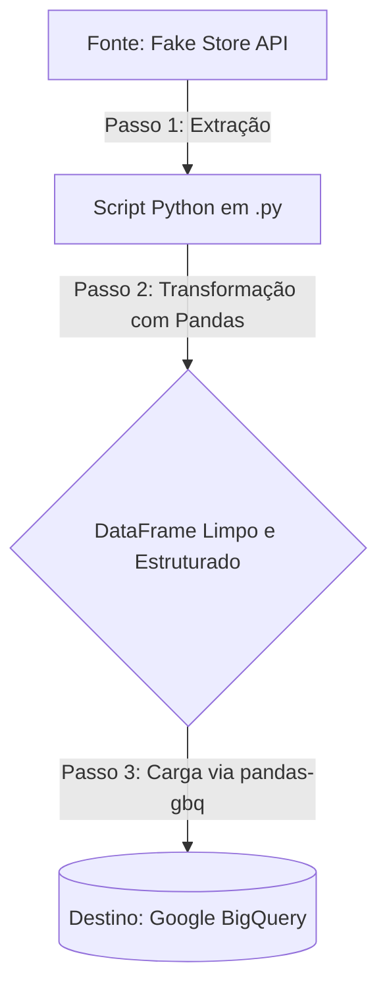

# Pipeline de ETL de Dados de Produtos (Fake Store API)


## 📖 Descrição

Este projeto implementa um pipeline de ETL (Extração, Transformação e Carga) completo e automatizado. O pipeline orquestra a extração de dados de produtos de uma API REST pública (Fake Store API), processa e limpa esses dados utilizando a biblioteca Pandas, e consolida o resultado em uma tabela no Google BigQuery, pronta para análises de Business Intelligence.

---

## ✨ Principais Funcionalidades

* **Extração de API:** Conexão com uma fonte de dados externa via REST API, com tratamento de erros de rede.
* **Transformação de Dados com Pandas:** Limpeza, seleção de colunas, e achatamento (flattening) de estruturas JSON aninhadas para um formato tabular.
* **Engenharia de Features:** Criação de novas colunas para enriquecer o dataset (ex: `data_hora_carga`).
* **Integração com Cloud Data Warehouse:** Carga dos dados transformados diretamente no Google BigQuery, demonstrando a integração com serviços de nuvem.
* **Gerenciamento Seguro de Credenciais:** Utilização de variáveis de ambiente para gerenciar as chaves de acesso ao GCP, evitando a exposição de informações sensíveis no código.

---

## 🏗️ Arquitetura do Pipeline

O fluxo de dados segue o padrão ETL clássico:



---

## 🚀 Tecnologias Utilizadas

* **Linguagem:** Python 3.9+
* **Bibliotecas Principais:** Pandas, Requests, Google Cloud BigQuery, Pandas-GBQ
* **Cloud:** Google BigQuery
* **Ambiente e Dependências:** `venv`, `pip`

---

## 📁 Estrutura do Projeto

```
.
├── credentials/
│   └── gcp_service_account.json  # (Adicionar manualmente)
├── src/
│   ├── __init__.py
│   ├── etl_pipeline.py           # Módulo com a lógica de E, T, e L
│   └── main.py                   # Ponto de entrada do projeto
├── .gitignore
├── config.py                     # Arquivo de configuração
├── README.md
└── requirements.txt
```

---

## ⚙️ Como Executar o Projeto

Siga os passos abaixo para executar o pipeline no seu ambiente local.

### Pré-requisitos
* Python 3.9 ou superior instalado.
* Uma conta no Google Cloud Platform com um projeto criado e a API do BigQuery ativada.
* O arquivo de credencial (`.json`) de uma Service Account do GCP com permissões de "Usuário do BigQuery" e "Editor de Dados do BigQuery".

### Passos

1.  **Clone o repositório:**
    ```bash
    git clone [https://github.com/seu-usuario/seu-repositorio.git](https://github.com/seu-usuario/seu-repositorio.git)
    cd seu-repositorio
    ```

2.  **Crie e ative o ambiente virtual:**
    ```bash
    python -m venv venv
    source venv/bin/activate  # No Windows: venv\Scripts\activate
    ```

3.  **Instale as dependências:**
    ```bash
    pip install -r requirements.txt
    ```

4.  **Configure as credenciais:**
    * Coloque seu arquivo de credencial `.json` do GCP dentro da pasta `credentials/`.
    * **Importante:** Renomeie o arquivo para `gcp_service_account.json` para que corresponda ao caminho no código.

5.  **Configure as variáveis do projeto:**
    * Abra o arquivo `config.py` e preencha as variáveis `GCP_PROJECT_ID`, `BIGQUERY_DATASET` e `BIGQUERY_TABLE_NAME` com as informações do seu projeto no Google Cloud.

6.  **Execute o pipeline:**
    * A partir da pasta **raiz** do projeto, execute o comando:
    ```bash
    python -m src.main
    ```

---

## ✅ Resultado Esperado

Após a execução, você verá no terminal as mensagens de log indicando o sucesso de cada etapa (Extração, Transformação e Carga).

Ao final, você poderá acessar seu projeto no console do Google BigQuery e encontrar a tabela `sales` (ou o nome que você definiu) dentro do seu dataset, populada com os dados de produtos já limpos e estruturados.
